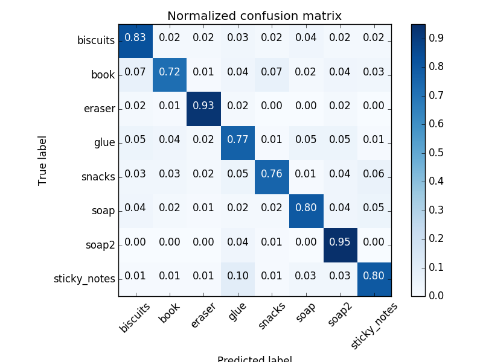

## Project: Perception Pick & Place
### Writeup Template: You can use this file as a template for your writeup if you want to submit it as a markdown file, but feel free to use some other method and submit a pdf if you prefer.

---


# Required Steps for a Passing Submission:
1. Extract features and train an SVM model on new objects (see `pick_list_*.yaml` in `/pr2_robot/config/` for the list of models you'll be trying to identify). 
2. Write a ROS node and subscribe to `/pr2/world/points` topic. This topic contains noisy point cloud data that you must work with.
3. Use filtering and RANSAC plane fitting to isolate the objects of interest from the rest of the scene.
4. Apply Euclidean clustering to create separate clusters for individual items.
5. Perform object recognition on these objects and assign them labels (markers in RViz).
6. Calculate the centroid (average in x, y and z) of the set of points belonging to that each object.
7. Create ROS messages containing the details of each object (name, pick_pose, etc.) and write these messages out to `.yaml` files, one for each of the 3 scenarios (`test1-3.world` in `/pr2_robot/worlds/`).  [See the example `output.yaml` for details on what the output should look like.](https://github.com/udacity/RoboND-Perception-Project/blob/master/pr2_robot/config/output.yaml)  
8. Submit a link to your GitHub repo for the project or the Python code for your perception pipeline and your output `.yaml` files (3 `.yaml` files, one for each test world).  You must have correctly identified 100% of objects from `pick_list_1.yaml` for `test1.world`, 80% of items from `pick_list_2.yaml` for `test2.world` and 75% of items from `pick_list_3.yaml` in `test3.world`.
9. Congratulations!  Your Done!

## [Rubric](https://review.udacity.com/#!/rubrics/1067/view) Points
### Here I will consider the rubric points individually and describe how I addressed each point in my implementation.  

---
### Writeup / README

#### 1. Provide a Writeup / README that includes all the rubric points and how you addressed each one.  You can submit your writeup as markdown or pdf.  

Here's project I implimanted. code is located in `pr2_robot/scripts/project_template.py`

### Exercise 1, 2 and 3 pipeline implemented
#### 1. Complete Exercise 1 steps. Pipeline for filtering and RANSAC plane fitting implemented.

##### PassThroghFilter
Applying a `PassThrough Filter` to fit to the range of objects.
I used z and x axis to filter.
```
filter_axis = 'z'
axis_min = 0.6
axis_max = 1.3

filter_axis = 'x'
axis_min = 0.34
axis_max = 1.0
```
X axis filter was used to exclude side boxes.

##### Statistical Outlier Filtering
Applying a `Statistical Outlier Filtering` to remove outlier noise points.
```
outlier_filter.set_mean_k(50)
```

##### RANSAC Plane Segmentation
Applying a `RANSAC Plane Segmentation` to divide objects and table.
```
seg = cloud_filtered.make_segmenter()
seg.set_model_type(pcl.SACMODEL_PLANE)
seg.set_method_type(pcl.SAC_RANSAC)
max_distance = 0.01
seg.set_distance_threshold(max_distance)
```

#### 2. Complete Exercise 2 steps: Pipeline including clustering for segmentation implemented.  

Use PCL's Euclidean Clustering algorithm to segment the points into indivisual objects.
```
 white_cloud = XYZRGB_to_XYZ(cloud_objects)
tree = white_cloud.make_kdtree()

# create a cluster extraction object
ec = white_cloud.make_EuclideanClusterExtraction()

ec.set_ClusterTolerance(0.016)
ec.set_MinClusterSize(30)
ec.set_MaxClusterSize(3000)

ec.set_SearchMethod(tree)
cluster_indices = ec.Extract()
```

#### 2. Complete Exercise 3 Steps.  Features extracted and SVM trained.  Object recognition implemented.

##### Capture features
I used `capture_feature.py` from Exercise3,and modify the models to following objects.

```
['sticky_notes','book','snacks','biscuits', 'eraser', 'soap2', 'soap', 'glue']
```
I tuned the following parameters in order to optimize the performance of the SVM classifier:
* number of poses per object to 100.
* rgb color space to hsv.
* number of bins of histogram to 32

I used `features.py` script placed on sensor_stick project.
(copied to pr2_robot/scripts) 

##### Training
Training scripts is `train_svm.py` and training results was following.


##### Recognition
I used concatinated features with color histogram and normal histogram same as training feature.
```
# extract histogram features
chists = compute_color_histograms(ros_cluster, using_hsv=True)
normals = get_normals(ros_cluster)
nhists = compute_normal_histograms(normals)
feature = np.concatenate((chists, nhists))

# Make the prediction,
prediction = clf.predict(scaler.transform(feature.reshape(1, -1)))
label = encoder.inverse_transform(prediction)[0]
```

### Pick and Place Setup

#### 1. For all three tabletop setups (`test*.world`), perform object recognition, then read in respective pick list (`pick_list_*.yaml`). Next construct the messages that would comprise a valid `PickPlace` request output them to `.yaml` format.

And here's another image! 


Spend some time at the end to discuss your code, what techniques you used, what worked and why, where the implementation might fail and how you might improve it if you were going to pursue this project further.  


